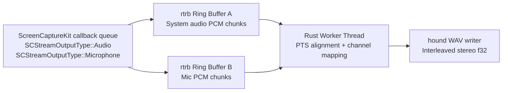

# Real-Time Architecture

## Threading Contract

Callback thread (high priority):
- Accept `CMSampleBuffer` from SCK.
- Convert/copy into preallocated chunk slots.
- Push into lock-free SPSC ring.
- No mutex, no heap growth, no disk I/O.

Worker thread (normal priority):
- Pop mic/system chunks.
- Align by PTS in one timeline.
- Downmix each source to mono.
- Interleave stereo (`L=mic`, `R=system`).
- Write WAV frames to disk.

## Buffer Data Contract

Per chunk:
- `kind`: `Audio` or `Microphone`
- `pts_seconds`: `CMSampleBuffer.presentation_timestamp()`
- `sample_rate_hz`
- `mono_samples: [f32; N]` (or fixed-capacity block + valid length)

## Interleave Rules

- Base timeline origin:
  - `base_pts = min(first_mic_pts, first_system_pts)`
- Placement:
  - `start_index = round((pts - base_pts) * sample_rate)`
- Stereo write:
  - frame `i`: `left = mic[i]`, `right = system[i]`

## Failure and Recovery

- If `SCStreamErrorSystemStoppedStream` occurs, restart stream and continue into new segment.
- If sample-rate mismatch occurs between mic/system, either:
  - fail fast in sprint 1, or
  - resample one side in worker (sprint 2).

## Prototype in Repo

- Probe: `src/main.rs`
- WAV recorder: `src/bin/sequoia_capture.rs`
- Build/run orchestration: `Makefile`

## Execution Modes

- Debug recorder (`make capture` / `cargo run --bin sequoia_capture`):
  - writes output relative to current shell working directory
- Signed app bundle (`make run-app`):
  - runs sandboxed as bundle id `com.recordit.sequoiacapture`
  - relative output paths resolve under `~/Library/Containers/com.recordit.sequoiacapture/Data/`

Note: current prototype uses bounded channels and owned vectors for delivery speed; production path uses `rtrb` with preallocated chunk pools for stricter real-time behavior.
